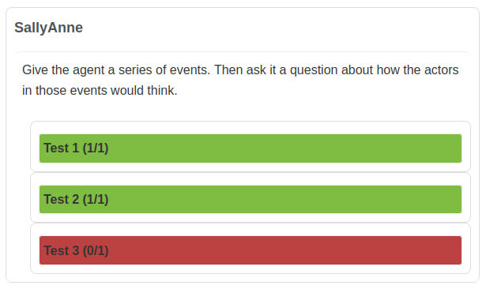
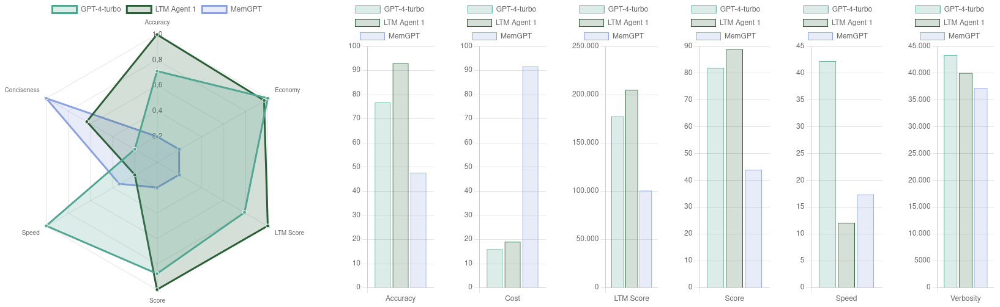

# Reports

After an agent is run against a benchmark, an HTML report containing all tests in full detail will be generated.
In the detailed report we provide a summary of the metrics, followed by a list of all the tests that the agent was subjected to, grouped by dataset or task type.



Every test presents initially a preview of the result, both colour coded and in written form. If you click on a test, a detailed view of the test conversation and a description of the evaluation process will unfold. These are the elements that you will find under each of them:

Task log. A selection of all the relevant messages exchanged between the virtual tester and the agent, which correspond to the test’s script, timestamps included. Keep in mind that distraction messages are not shown here.
Evaluations. A list of all answers given by the agent, accompanied by their corresponding expected answers and a reasoning of why the answer is considered correct or not.
Score. The resulting score for this test, which usually adds up to one point for each correct answer.
Memory span. The distance in the conversation between the first relevant information given and the final question, which is displayed in tokens and in characters.

Additionally, a [comparative report](https://htmlpreview.github.io/?https://github.com/GoodAI/goodai-ltm-benchmark/blob/main/data/reports/Comparative%20Report%20-%20Benchmark%201%20-%2010k%20Filler.html) can be generated after two or more agents have been run. For this report, all agents’ results will be collected and shown in a format optimised for visual interpretation.




On the left, the comparative report shows a radar chart which compares the agents selected on a relative scale. In the radar chart, metric values are converted to alternative units in which higher values are better and the comparison becomes easier. On the right side, the original metric values are shown in their original units and scale.

All these reports are self-contained and without dependencies, which makes them great for being sent as stand-alone documents and ensuring a flawless visualization in any navigator. They can be also generated at any time, as long as the benchmark result files are available.

# Generation

These files here generate the reports for the benchmarks. There are two report generators:
* `detailed_report.py` Which generates a detailed list of the tests that an agent has performed in a benchmark run.
* `comparative_report.py` Which generates a report comparing multiple agents in a benchmark.

## Detailed Reports

The detailed report is run automatically on the end of a benchmark run, but if you wish to run the report generation manually use:
```bash
python detailed_report.py <benchmark_name> <agent_id> -o <output_name>
```

As an example:
```bash
python detailed_report.py "Benchmark 3 - 500k" \
                          "LLMChatSession - gpt-4-turbo- 128000" \
                          -o my_detailed_report
```
Where `LLMChatSession - gpt-4-turbo- 128000` is a folder inside `tests/Benchmark 3 - 500k/results/`. The folder name corresponds to the unique agent ID, which is expected to include any setting value that is subject to change.

## Comparative Reports

Comparative reports contrast multiple agents against each other.
```bash
python comparative_report.py <benchmark_name>
```
You will be prompted to select which runs should be compared, and which labels you want to assign to the agents in the report.